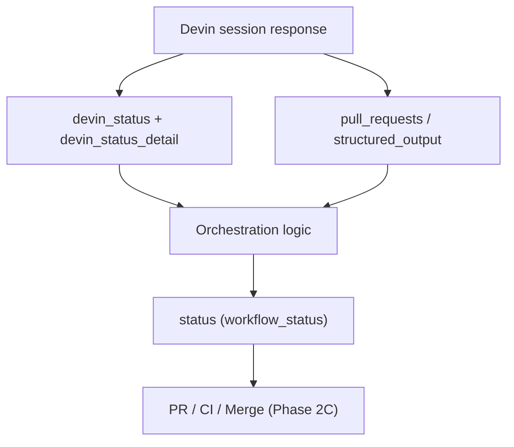

# status_detail 语义修正 + 双维度状态模型

## 核心原则

**不要把 Devin 的 execution state 当成系统唯一的 `TaskStatus`。**

采用双维度模型：

```text
RemediationTask
├── status (workflow_status)   ← 业务 workflow 走到哪一步
├── devin_status               ← Devin 原始 status，原样保存
├── devin_status_detail        ← Devin 原始 detail，原样保存
├── pr_state
└── ...
```



- **Devin 状态**描述 agent 当前执行状态（`new`, `running`, `exit`, `suspended`…）
- **Workflow 状态**描述 remediation 业务进度（`PR_OPENED`, `READY_FOR_REVIEW`, `MERGED`…）
- 两者不是一回事；UI 和 alert 应同时展示两个维度，而不是压成一个枚举

**不新增 `TaskStatus` 枚举值** — `WAITING_FOR_USER`、`SUSPENDED`、`RESUMING` 等属于 Devin execution semantics，由 `devin_status` / `devin_status_detail` 表达。

## 问题（当前代码）

[`session_lifecycle.py`](backend/app/services/session_lifecycle.py) 把 `running`、`resuming`、`suspended` 一律映射为 `RUNNING`，且 `error` 无条件 → `FAILED`，丢失了 Devin 细粒度语义：

```97:103:backend/app/services/session_lifecycle.py
    elif devin_status in {"running", "resuming", "suspended"}:
        if pr is not None:
            target = TaskStatus.PR_OPENED
        else:
            target = TaskStatus.RUNNING
    elif devin_status == "error":
        target = TaskStatus.FAILED
```

[`DevinSessionResponse`](backend/app/schemas/devin_session.py) 未解析 `status_detail`、`origin`、`service_user_id`、`tags`。

## Workflow status（保持精简）

继续使用现有 `TaskStatus` 枚举（DB 列名仍为 `status`，语义上即 `workflow_status`）：

```text
RECEIVED → SESSION_CREATED → RUNNING → PR_OPENED → READY_FOR_REVIEW → MERGED
                                    ↘ FAILED / ESCALATED
CI_FAILED  ← Phase 2C 用，代表 CI workflow 而非 Devin state
```

不在枚举中增加 Devin execution 状态。

## 映射规则（Devin → workflow_status）

**原则：workflow 推进由业务里程碑（PR、exit、blocked）驱动；Devin execution 细节原样落库，供 UI/alert 使用。**

| Devin `status` | `status_detail` | PR 存在 | workflow_status | 说明 |
|---|---|---|---|---|
| `new`, `claimed` | — | 否 | `SESSION_CREATED` | 会话已创建，尚未实质推进 |
| `new`, `claimed` | — | 是 | `PR_OPENED` | 早期即有 PR（少见但合法） |
| `running`, `resuming` | 任意 | 是 | `PR_OPENED` | workflow 已到 PR 阶段 |
| `running`, `resuming` | 任意 | 否 | `RUNNING` | detail（`working`/`waiting_for_user` 等）仅展示，不改 workflow |
| `suspended` | `usage_limit_exceeded`, `out_of_credits` | 否 | `ESCALATED` | 资源/额度问题 |
| `suspended` | `usage_limit_exceeded`, `out_of_credits` | 是 | `PR_OPENED` | **有 PR 时 workflow 保持 PR 阶段**；`devin_status=suspended` + detail 供 alert |
| `suspended` | `user_request`, `inactivity`, 其他 | 任意 | **不变** | 不再当作 `RUNNING`；仅更新 devin 字段 |
| `error` | — | 是 | `PR_OPENED` | **调整**：PR 已存在则 workflow 不降级为 `FAILED` |
| `error` | — | 否 | `FAILED` | 无 PR 的 error 才是失败 |
| `exit` | — | 是 | `READY_FOR_REVIEW` | 保持现有逻辑 |
| `exit` | — | 否 + blocked | `ESCALATED` | structured_output |
| `exit` | — | 否 + failed | `FAILED` | structured_output |
| `exit` | — | 否（其他） | `FAILED` | 保持现有逻辑 |

**关键调整（相对初版计划）：**

- 放弃「PR 永远优先覆盖一切 Devin status」的刚性规则
- 改为：**workflow 里程碑（PR 存在）与 Devin terminal state（error/exit）分层处理**
- `error` + PR → workflow `PR_OPENED`，UI 显示 "PR exists, but Devin session terminated with error"
- `suspended` + escalation detail + PR → workflow `PR_OPENED`（不强制 `ESCALATED`），由 UI 根据 devin 字段告警

`escalation_reason` 补充：`Devin session suspended: {status_detail}`（仅 workflow 进入 `ESCALATED` 时）。

## 实现步骤

### 1. 扩展 Devin session schema

**文件:** [`backend/app/schemas/devin_session.py`](backend/app/schemas/devin_session.py)

新增并解析：`status_detail`, `origin`, `service_user_id`, `tags`。

更新 [`backend/tests/test_devin_client.py`](backend/tests/test_devin_client.py)。

### 2. 持久化 audit 字段（每次 poll 写入）

**文件:** [`backend/app/models/task.py`](backend/app/models/task.py)

| 列名 | 类型 | 说明 |
|---|---|---|
| `devin_status` | `String(32)` | Devin `status` 原样 |
| `devin_status_detail` | `String(64)` | Devin `status_detail` 原样 |
| `devin_origin` | `String(32)` | `api` / `automation` / `code_scan` 等 |
| `devin_service_user_id` | `String(128)` | 可选 |
| `devin_tags` | `Text` | JSON 数组 |

**文件:** [`backend/app/schemas/task.py`](backend/app/schemas/task.py) — `TaskResponse` 暴露上述字段；`status` 字段文档注明其为 workflow status。

**文件:** [`backend/app/services/orchestration.py`](backend/app/services/orchestration.py) — `apply_session_update()` 每次 poll **始终**写入 devin audit 字段，即使 workflow status 不变。

### 3. 细化 mapping 逻辑

**文件:** [`backend/app/services/session_lifecycle.py`](backend/app/services/session_lifecycle.py)

- 新增 `SUSPENDED_ESCALATION_DETAILS = {"usage_limit_exceeded", "out_of_credits"}`
- 从 `running/resuming/suspended` 分支移除 `suspended`，独立 `_resolve_suspended_status()`
- 调整 `error` 分支：有 PR → `PR_OPENED`，无 PR → `FAILED`
- 扩展 `resolve_exit_escalation_reason()` 覆盖 suspended escalation

**文件:** [`backend/tests/test_session_lifecycle.py`](backend/tests/test_session_lifecycle.py)

新增/更新用例：

- `suspended` + `inactivity` → workflow 不变
- `suspended` + `usage_limit_exceeded` + 无 PR → `ESCALATED`
- `suspended` + `usage_limit_exceeded` + 有 PR → `PR_OPENED`（devin 字段保留）
- `error` + 有 PR → `PR_OPENED`（**新行为**，替换现有 `FAILED`）
- `error` + 无 PR → `FAILED`
- `running` + `waiting_for_user` → `RUNNING`，detail 持久化

### 4. Dashboard 双维度展示

**文件:** [`frontend/src/types/task.ts`](frontend/src/types/task.ts), [`frontend/src/components/TaskTable.tsx`](frontend/src/components/TaskTable.tsx)

目标展示（示例）：

```text
Status          Devin                    PR           ACU
PR OPENED       running · working        #2 · Open    4.2
PR OPENED       running · waiting_for_user  #2 · Open   4.2  ⚠️ Human action required
ESCALATED       suspended · usage_limit_exceeded  —     4.2
PR OPENED       error · —                  #2 · Open    4.2  ⚠️ Devin session error
```

具体实现：

| 列 | 内容 |
|---|---|
| **Status** | 现有 `StatusBadge`（workflow status） |
| **Devin** | `{devin_status} · {devin_status_detail}`，detail 人类可读 label |
| **Source** | `devin_origin` 映射；空则 fallback `GitHub` |
| **PR** | 链接 + `pr_state`（如 `Open`） |
| **ACU** | 保持现有 |

条件 alert（表格行内 muted 警告或 badge）：

- `devin_status_detail` ∈ `{waiting_for_user, waiting_for_approval}` → "Human action required"
- `devin_status = error` 且 workflow ≥ `PR_OPENED` → "Devin session error"
- `devin_status = suspended` + escalation detail → "Usage limit exceeded"（workflow 已是 `ESCALATED` 时强化说明）

### 5. 文档

**文件:** [`README.md`](README.md) Phase 2B

- 说明双维度状态模型（workflow vs Devin execution）
- 更新 mapping 表（含 `error`+PR 调整）
- 列出持久化 audit 字段
- DB 重建说明（无 Alembic）

## 不在本次范围

- 将 DB/API 列 `status` 重命名为 `workflow_status`（语义文档化即可，避免 breaking change）
- 新增 Devin execution 相关的 `TaskStatus` 枚举值
- `structured_output` 全文持久化
- Phase 2C：GitHub merge/CI webhook
- Poller 中 timeout/ACU cap escalate 检查

## 验证

```bash
cd backend && pytest tests/test_session_lifecycle.py tests/test_devin_client.py tests/test_session_poller.py -q
cd frontend && npm run build
```

手动：重建 DB 后 poll，确认 Dashboard 同时展示 workflow status 与 Devin execution 两行语义。

## Todos

- [ ] 扩展 DevinSessionResponse + 解析测试
- [ ] RemediationTask 新增 devin audit 列；TaskResponse 暴露；apply_session_update 每次 poll 写入
- [ ] session_lifecycle：双维度 mapping（suspended 独立、error+PR 调整）；单元测试
- [ ] TaskTable 双维度展示（Status + Devin 列 + 条件 alert）+ frontend 类型
- [ ] README 双维度模型与 mapping 表更新
