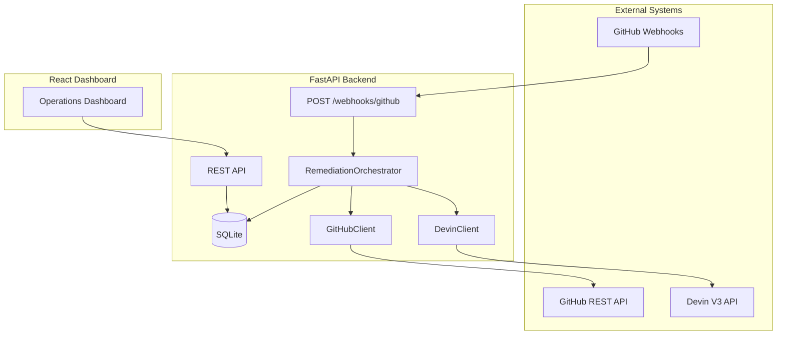
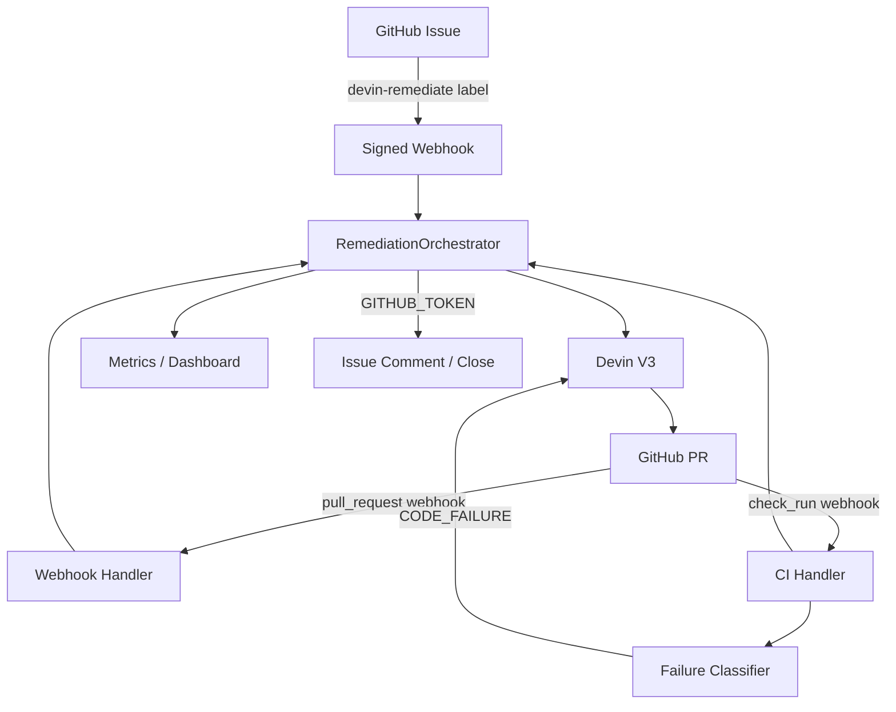
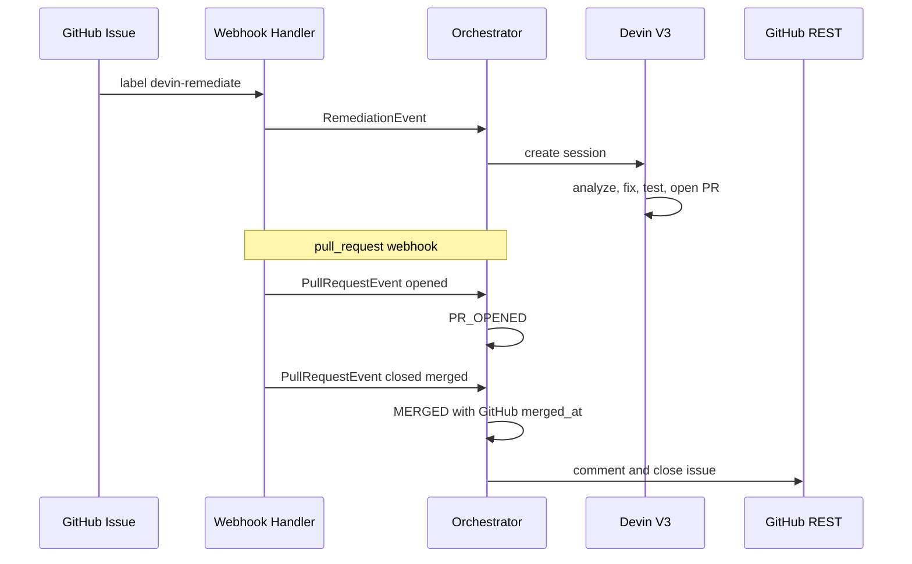
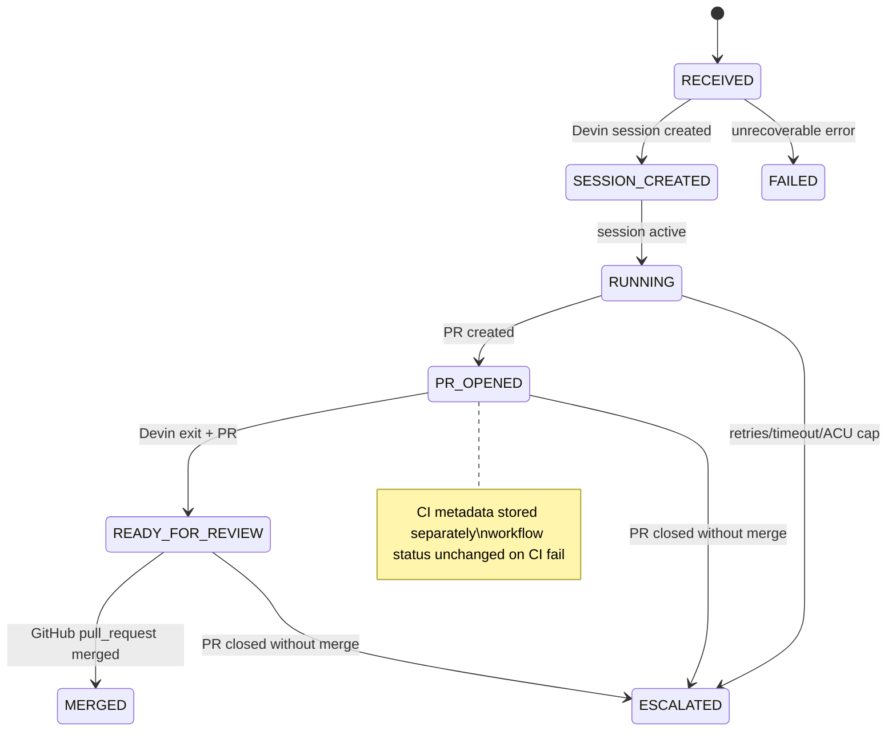
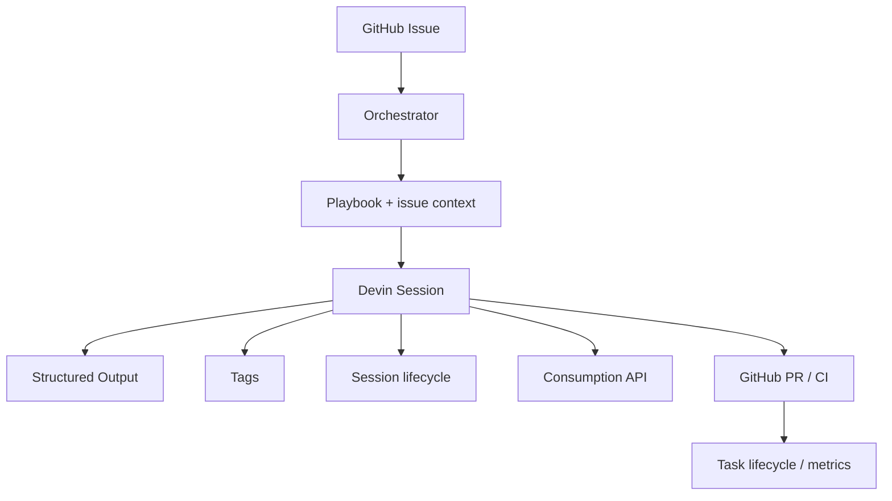
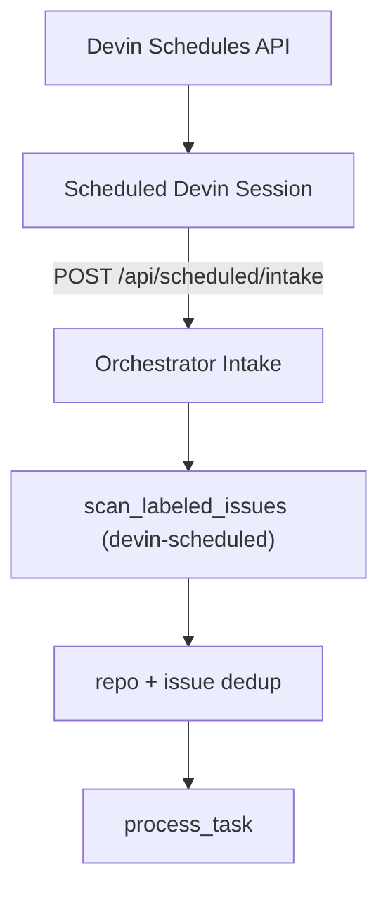
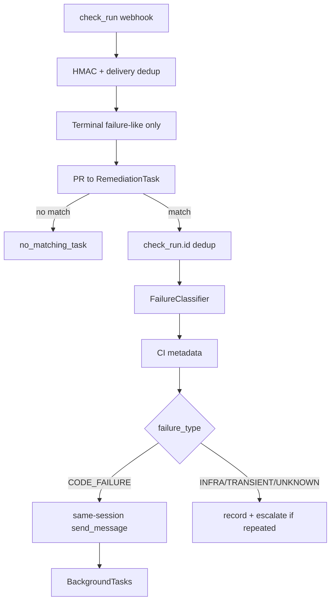
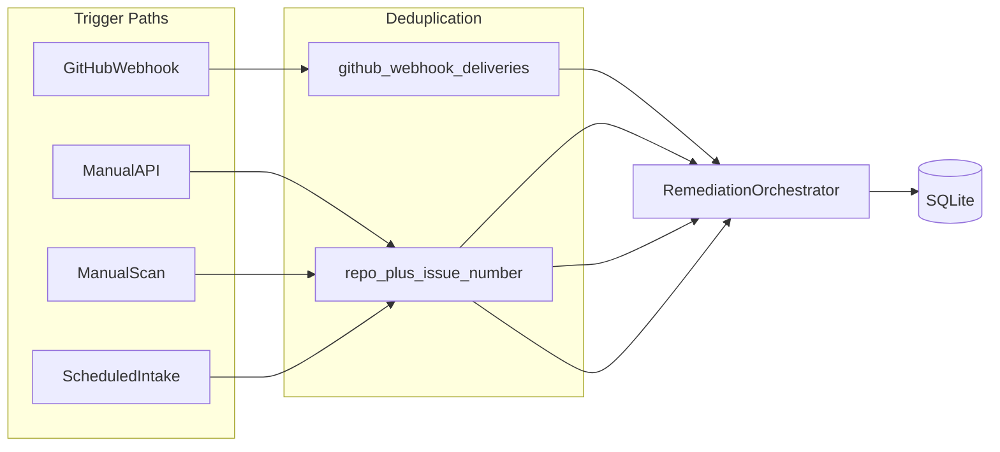

# Architecture

## Overview

The Devin Remediation Orchestrator is an external event-driven platform that decides **when** engineering remediation should happen. Devin decides **how** the work gets done.

## System Components

## Trust Boundaries

| Zone | Contains | Never Exposed |
|------|----------|---------------|
| Backend | `DEVIN_API_KEY`, `GITHUB_TOKEN`, `GITHUB_WEBHOOK_SECRET` | Via API responses or logs |
| Frontend | `VITE_API_BASE_URL` only | Any backend secrets |
| GitHub webhooks | HMAC signatures | Raw secret in payloads |

### Three distinct GitHub trust relationships

| Credential | Direction | Purpose |
|------------|-----------|---------|
| `GITHUB_WEBHOOK_SECRET` | GitHub → Orchestrator | Verify webhook authenticity |
| `GITHUB_TOKEN` | Orchestrator → GitHub | Issue comment, issue close, PR fetch |
| Devin GitHub integration | Devin → GitHub | Devin's connected repo engineering actions |

## Event Lifecycle

## Task State Lifecycle

Phase 3: CI failure metadata is stored on the task without transitioning workflow `status` to `CI_FAILED`. The legacy `CI_FAILED` enum value remains for compatibility but is unused in Phase 3 logic.

## Status Authority

| Dimension | Authoritative Source | Stored Fields |
|-----------|---------------------|---------------|
| Workflow progress | Orchestrator | `status` |
| Agent execution | Devin V3 session poll | `devin_status`, `devin_status_detail` |
| PR / merge state | GitHub `pull_request` webhooks | `pr_url`, `pr_state`, `merged_at` |
| CI failure state | GitHub `check_run` webhooks + classifier | `failure_type`, `ci_check_name`, `ci_conclusion`, `ci_repair_attempts`, etc. |

Devin PR state from session polling is superseded by GitHub webhook data for `pr_state`.

## Devin Integration Boundary

All Devin HTTP logic lives in `backend/app/services/devin.py`. Consumption and analytics are isolated in `devin_consumption.py` and `devin_analytics.py`.

Verified V3 endpoints (see [Devin API docs](https://docs.devin.ai/api-reference/v3/usage-examples)):

- `POST /v3/organizations/{org_id}/sessions` — create session (with `structured_output_schema`, `playbook_id`, `tags`)
- `GET /v3/organizations/{org_id}/sessions/{devin_id}` — get session
- `POST /v3/organizations/{org_id}/sessions/{devin_id}/messages` — same-session CI repair (Phase 3)
- `GET /v3/organizations/{org_id}/consumption/daily/sessions/{session_id}` — session ACU consumption
- `GET /v3/organizations/{org_id}/consumption/daily` — org analytics
- `POST /v3/organizations/{org_id}/schedules` — scheduled intake (opt-in)

Live calls gated by `DEVIN_LIVE_ENABLED=false` by default. Scheduled Devin gated by `DEVIN_SCHEDULED_ENABLED=false`.

### Phase 5: Playbook + Structured Output + Consumption

Structured output informs failure/escalation reasons but does not set `MERGED`. Final ACU sync runs on terminal Devin status and after merge.

### Scheduled Devin Intake

Scheduled intake scans issues labeled `devin-scheduled` (`SCHEDULED_LABEL`). Webhook and manual scan use `devin-remediate` (`REMEDIATE_LABEL`). Same idempotency rules apply across all paths.

## GitHub Integration Boundary

### Webhook layer (thin)

`POST /webhooks/github` responsibilities:

- HMAC-SHA256 verification via `X-Hub-Signature-256`
- Event routing by `X-GitHub-Event`
- Payload normalization to domain events
- Delivery deduplication
- Dispatch to `RemediationOrchestrator` (no business logic in route)

Supported events:

| Event | Trigger | Action |
|-------|---------|--------|
| `issues` | `labeled` + `devin-remediate` | Create remediation task, async Devin dispatch |
| `pull_request` | `opened`, `reopened`, `synchronize`, `closed` | Update PR metadata, merge lifecycle |
| `check_run` | `completed` + failure-like conclusion | Classify CI failure, persist metadata, optional same-session repair |

### check_run processing

**Classification precedence:**

1. `cancelled` / `timed_out` / `stale` → `TRANSIENT_FAILURE`
2. `startup_failure` or infrastructure signals → `INFRA_FAILURE`
3. `failure` + code/test signals → `CODE_FAILURE`
4. Otherwise → `UNKNOWN`

**Trust boundaries:** Classification is deterministic (no LLM). Devin is invoked only for `CODE_FAILURE` when `devin_session_id` exists and `DEVIN_LIVE_ENABLED=true`.

**Deduplication:** `X-GitHub-Delivery` (webhook-level) + `last_ci_check_run_id` (task-level).

**Repair limits:** `MAX_CI_REPAIR_ATTEMPTS` (default 2). Exceeding → `ESCALATED`.

**Audit trail:** `failure_type`, `ci_classification_reason`, `ci_check_name`, `ci_conclusion`, `ci_failure_at`, `ci_repair_attempts`, `ci_repair_message_sent_at`, `ci_repair_verified_at`.

### Deduplication

- `X-GitHub-Delivery` recorded in `github_webhook_deliveries` — prevents duplicate lifecycle transitions
- `(github_repository, github_issue_number)` — business unique key for task creation

### REST client

`backend/app/services/github.py`:

- `list_issues_by_label` — manual scan
- `create_issue_comment` — post-merge notification
- `close_issue` — close originating issue after verified merge
- `get_issue` — idempotent close check
- `get_pull_request` — PR state verification helper

Uses `GITHUB_TOKEN` (Orchestrator → GitHub). Separate from Devin's GitHub integration.

## Persistence

- SQLite via SQLAlchemy 2.x
- `remediation_tasks` — full audit trail
- `github_webhook_deliveries` — webhook idempotency log
- Failed and escalated tasks are never auto-deleted

## CI Self-Correction (Phase 3)

When CI fails on a Devin-opened PR:

1. Orchestrator receives `check_run` webhook and classifies failure
2. CI metadata persisted; workflow `status` unchanged
3. For `CODE_FAILURE`: sends CI context to the **same** Devin session via `send_message` (background)
4. Devin diagnoses and pushes a fix to the existing PR
5. Subsequent successful `check_run` sets `ci_repair_verified_at`
6. Loop bounded by `MAX_CI_REPAIR_ATTEMPTS`; non-code failures escalate after `MAX_CI_NON_CODE_FAILURES`

Repair success is **not** inferred from `send_message` ACK — only from subsequent GitHub check evidence.

## Observability Metrics

| Metric | Definition |
|--------|------------|
| Success Rate | `MERGED / terminal tasks` |
| Merge Rate | `MERGED / total tasks` (GitHub-verified merges only) |
| Median MTTR | Median of `(merged_at - started_at)` for `MERGED` tasks only |
| Throughput | Tasks created in last 7 days |
| CI Recovery Rate | `ci_repair_verified_at` tasks / tasks with `ci_failure_at` |
| CI Failure Breakdown | Counts by `failure_type` |
| CI Repair Attempts | Sum of `ci_repair_attempts` |
| CI Repair Successes | Tasks with `ci_repair_verified_at` set |
| Total ACU | Sum of `acu_used` across tasks (all reported values) |
| Verified ACU | Sum of `acu_used` where `acu_verified=true` |
| Devin Org ACU | From Devin analytics API when available |
| Active Sessions | Tasks in `SESSION_CREATED`, `RUNNING`, `PR_OPENED`, `CI_FAILED` |

## Failure Handling

- Retryable API errors: increment `retry_count`
- `retry_count >= max_retries` → `ESCALATED`
- Session timeout → `ESCALATED`
- ACU budget exceeded → `ESCALATED`
- PR closed without merge → `ESCALATED`
- CI repair attempts exceeded → `ESCALATED`
- Repeated non-code CI failures → `ESCALATED`
- Post-merge GitHub API failures: log, preserve `MERGED` status

## Future Extension Points

- Additional event sources (Jira, Linear, security scanners)
- Multi-repository rollout
- Policy-based approval gates
- Slack notifications
- Additional schedule types beyond intake triage
