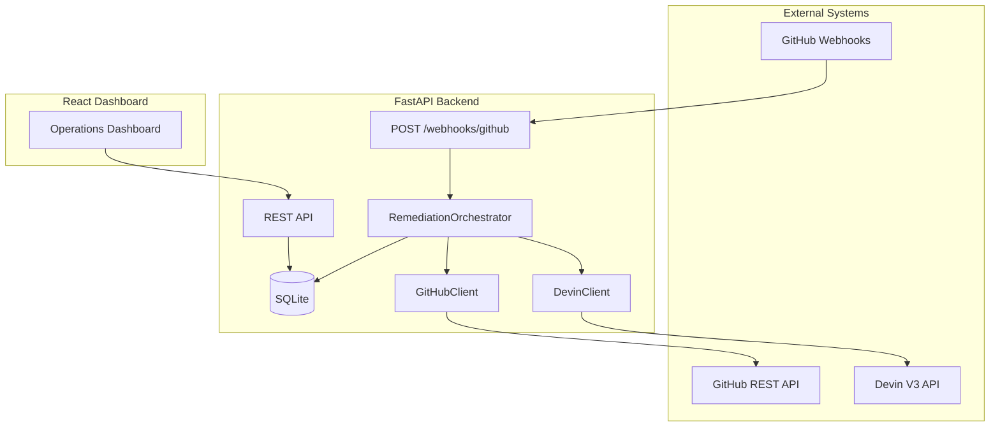
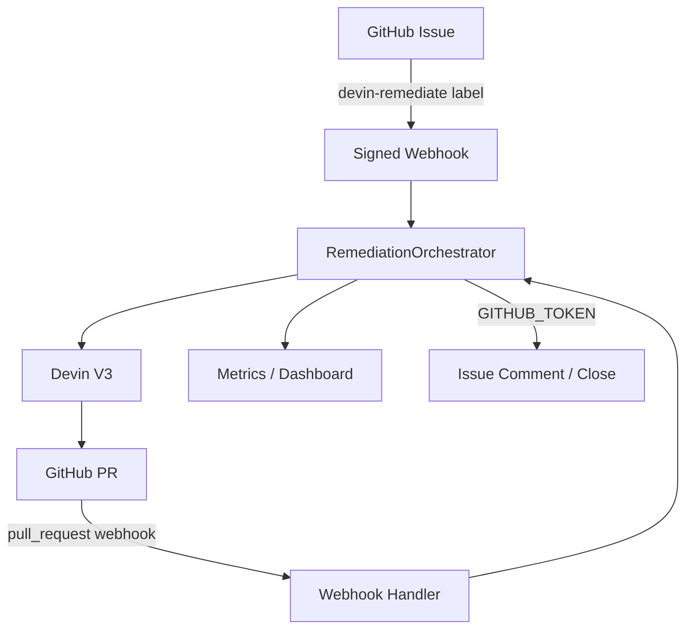
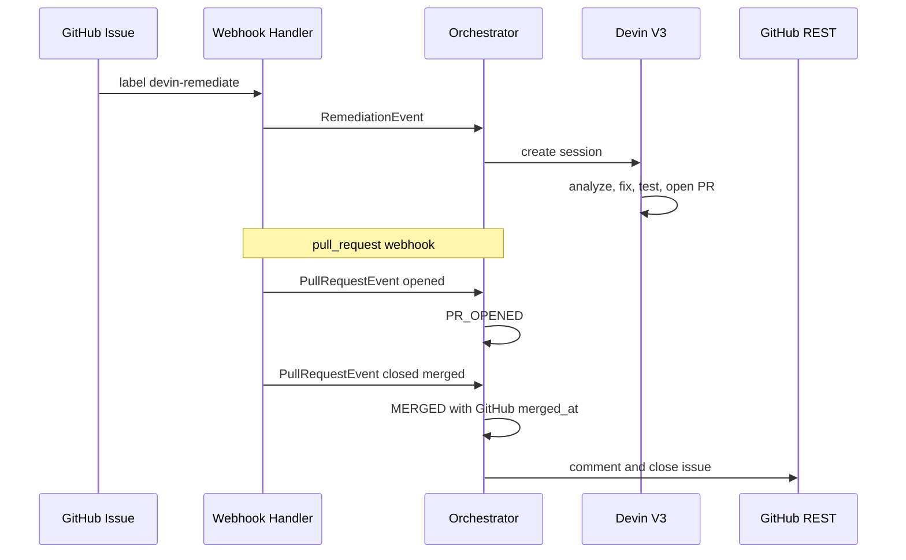
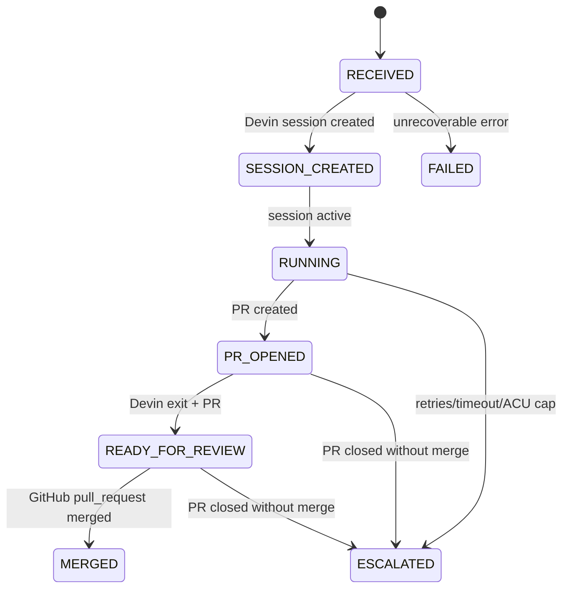
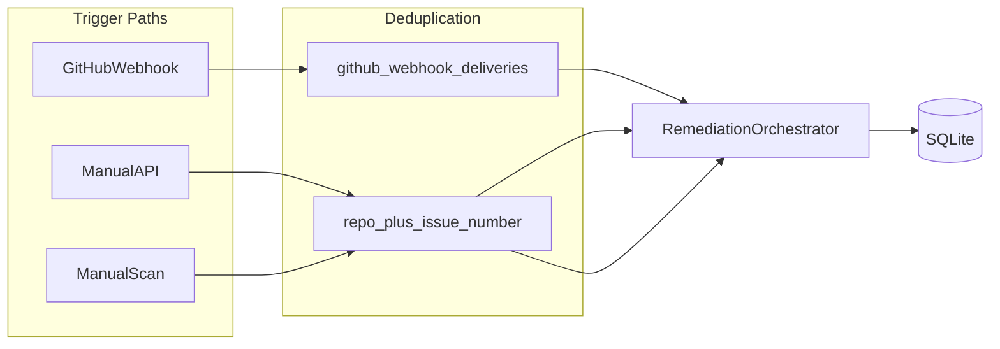

# Architecture

## Overview

The Devin Remediation Orchestrator is an external event-driven platform that decides **when** engineering remediation should happen. Devin decides **how** the work gets done.

## System Components

## Trust Boundaries

| Zone | Contains | Never Exposed |
|------|----------|---------------|
| Backend | `DEVIN_API_KEY`, `GITHUB_TOKEN`, `GITHUB_WEBHOOK_SECRET` | Via API responses or logs |
| Frontend | `VITE_API_BASE_URL` only | Any backend secrets |
| GitHub webhooks | HMAC signatures | Raw secret in payloads |

### Three distinct GitHub trust relationships

| Credential | Direction | Purpose |
|------------|-----------|---------|
| `GITHUB_WEBHOOK_SECRET` | GitHub → Orchestrator | Verify webhook authenticity |
| `GITHUB_TOKEN` | Orchestrator → GitHub | Issue comment, issue close, PR fetch |
| Devin GitHub integration | Devin → GitHub | Devin's connected repo engineering actions |

## Event Lifecycle

## Task State Lifecycle

Phase 3 (not implemented): `CI_FAILED` transitions and Devin `send_message` self-correction loop.

## Status Authority

| Dimension | Authoritative Source | Stored Fields |
|-----------|---------------------|---------------|
| Workflow progress | Orchestrator | `status` |
| Agent execution | Devin V3 session poll | `devin_status`, `devin_status_detail` |
| PR / merge state | GitHub `pull_request` webhooks | `pr_url`, `pr_state`, `merged_at` |

Devin PR state from session polling is superseded by GitHub webhook data for `pr_state`.

## Devin Integration Boundary

All Devin HTTP logic lives in `backend/app/services/devin.py`.

Verified V3 endpoints (see [Devin API docs](https://docs.devin.ai/api-reference/v3/usage-examples)):

- `POST /v3/organizations/{org_id}/sessions` — create session
- `GET /v3/organizations/{org_id}/sessions/{devin_id}` — get session
- `POST /v3/organizations/{org_id}/sessions/{devin_id}/messages` — send follow-up (Phase 3)

Live calls gated by `DEVIN_LIVE_ENABLED=false` by default.

## GitHub Integration Boundary

### Webhook layer (thin)

`POST /webhooks/github` responsibilities:

- HMAC-SHA256 verification via `X-Hub-Signature-256`
- Event routing by `X-GitHub-Event`
- Payload normalization to domain events
- Delivery deduplication
- Dispatch to `RemediationOrchestrator` (no business logic in route)

Supported events:

| Event | Trigger | Action |
|-------|---------|--------|
| `issues` | `labeled` + `devin-remediate` | Create remediation task, async Devin dispatch |
| `pull_request` | `opened`, `reopened`, `synchronize`, `closed` | Update PR metadata, merge lifecycle |

### Deduplication

- `X-GitHub-Delivery` recorded in `github_webhook_deliveries` — prevents duplicate lifecycle transitions
- `(github_repository, github_issue_number)` — business unique key for task creation

### REST client

`backend/app/services/github.py`:

- `list_issues_by_label` — manual scan
- `create_issue_comment` — post-merge notification
- `close_issue` — close originating issue after verified merge
- `get_issue` — idempotent close check
- `get_pull_request` — PR state verification helper

Uses `GITHUB_TOKEN` (Orchestrator → GitHub). Separate from Devin's GitHub integration.

## Persistence

- SQLite via SQLAlchemy 2.x
- `remediation_tasks` — full audit trail
- `github_webhook_deliveries` — webhook idempotency log
- Failed and escalated tasks are never auto-deleted

## CI Self-Correction Design (Phase 3 — not implemented)

When CI fails on a Devin-opened PR:

1. Orchestrator detects failure (`check_run` webhook)
2. Task transitions to `CI_FAILED`
3. Orchestrator sends CI logs to the **same** Devin session via `send_message`
4. Devin diagnoses and pushes a fix
5. CI reruns; loop until pass or escalation

## Observability Metrics

| Metric | Definition |
|--------|------------|
| Success Rate | `MERGED / terminal tasks` |
| Merge Rate | `MERGED / total tasks` (GitHub-verified merges only) |
| Median MTTR | Median of `(merged_at - started_at)` for `MERGED` tasks only |
| Throughput | Tasks created in last 7 days |
| CI Recovery Rate | Heuristic based on `retry_count` (Phase 3 will improve) |
| Total ACU | Sum of `acu_used` across tasks |
| Active Sessions | Tasks in `SESSION_CREATED`, `RUNNING`, `PR_OPENED`, `CI_FAILED` |

## Failure Handling

- Retryable API errors: increment `retry_count`
- `retry_count >= max_retries` → `ESCALATED`
- Session timeout → `ESCALATED`
- ACU budget exceeded → `ESCALATED`
- PR closed without merge → `ESCALATED`
- Post-merge GitHub API failures: log, preserve `MERGED` status

## Future Extension Points

- CI self-correction (Phase 3)
- Additional event sources (Jira, Linear, security scanners)
- Multi-repository rollout
- Policy-based approval gates
- Slack notifications
- Scheduled remediation jobs
