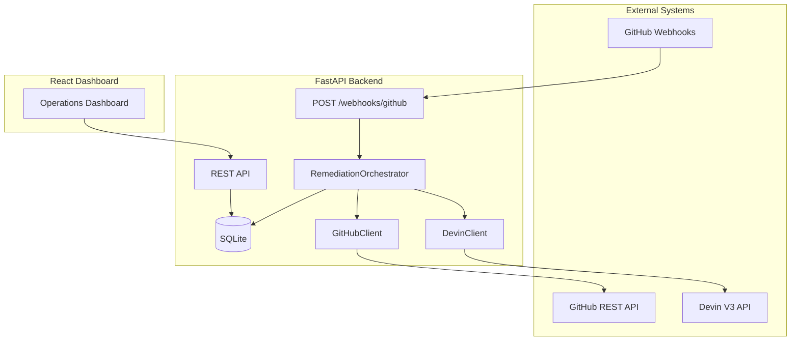
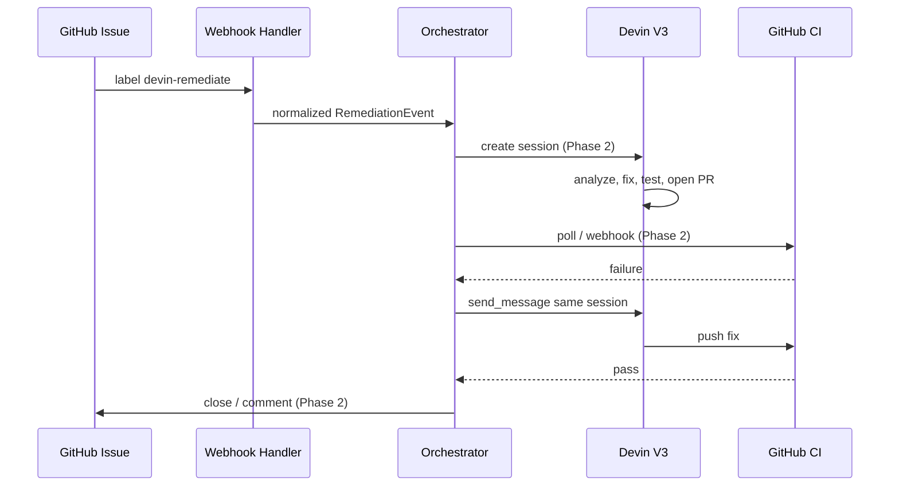
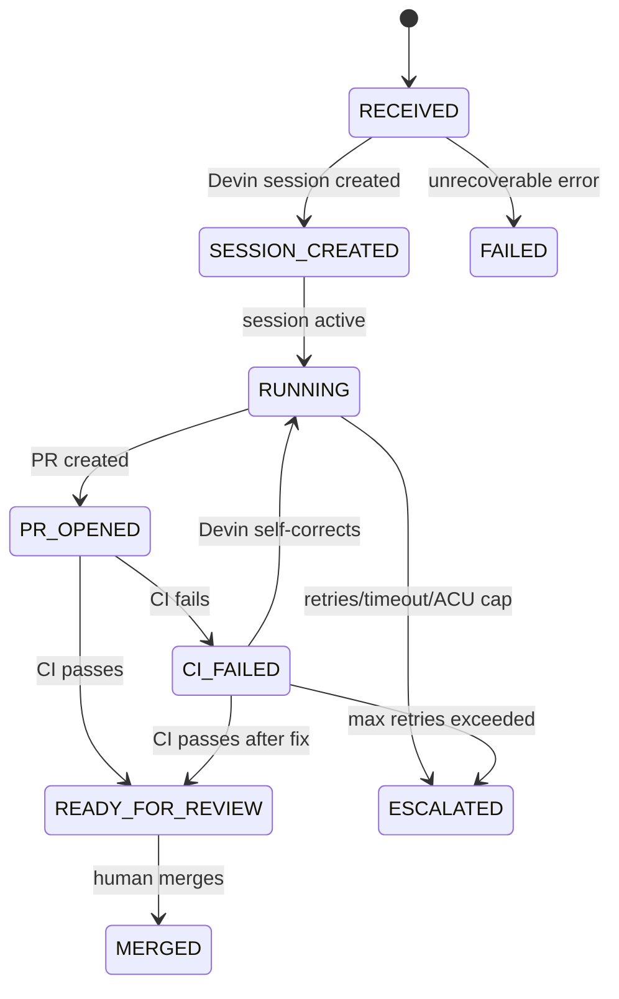
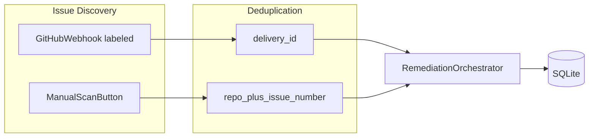

# Architecture

## Overview

The Devin Remediation Orchestrator is an external event-driven platform that decides **when** engineering remediation should happen. Devin decides **how** the work gets done.

## System Components

## Trust Boundaries

| Zone | Contains | Never Exposed |
|------|----------|---------------|
| Backend | `DEVIN_API_KEY`, `GITHUB_TOKEN`, `GITHUB_WEBHOOK_SECRET` | Via API responses or logs |
| Frontend | `VITE_API_BASE_URL` only | Any backend secrets |
| GitHub | Webhook HMAC signatures | Raw secret in payloads |

## Event Lifecycle

## Task State Lifecycle

## Devin Integration Boundary

All Devin HTTP logic lives in `backend/app/services/devin.py`.

Verified V3 endpoints (see [Devin API docs](https://docs.devin.ai/api-reference/v3/usage-examples)):

- `POST /v3/organizations/{org_id}/sessions` — create session
- `GET /v3/organizations/{org_id}/sessions/{devin_id}` — get session
- `POST /v3/organizations/{org_id}/sessions/{devin_id}/messages` — send follow-up

Phase 1: client implemented; live calls gated by `DEVIN_LIVE_ENABLED=false`.

## GitHub Integration Boundary

- Webhook: HMAC-SHA256 verification via `X-Hub-Signature-256`
- Deduplication (dual layer):
  - `X-GitHub-Delivery` — webhook retry dedup
  - `(github_repository, github_issue_number)` — business unique key across webhook and manual scan
- Manual scan: `POST /api/scan/github` lists open labeled issues via GitHub REST API
- REST client in `backend/app/services/github.py` (`list_issues_by_label` implemented; PR/CI methods Phase 2)

## Persistence

- SQLite via SQLAlchemy 2.x
- `remediation_tasks` table stores full audit trail
- Failed and escalated tasks are never auto-deleted

## CI Self-Correction Design (Phase 2)

When CI fails on a Devin-opened PR:

1. Orchestrator detects failure (webhook or poll)
2. Task transitions to `CI_FAILED`
3. Orchestrator sends CI logs to the **same** Devin session via `send_message`
4. Devin diagnoses and pushes a fix
5. CI reruns; loop until pass or escalation

## Observability Metrics

| Metric | Definition |
|--------|------------|
| Success Rate | `MERGED / terminal tasks` |
| Merge Rate | Same as success rate for merged outcomes |
| Median MTTR | Median of `(merged_at - started_at)` for merged tasks only |
| Throughput | Tasks created in last 7 days |
| CI Recovery Rate | Tasks that recovered from `CI_FAILED` to `READY_FOR_REVIEW` or `MERGED` |
| Total ACU | Sum of `acu_used` across tasks |
| Active Sessions | Tasks in `SESSION_CREATED`, `RUNNING`, `PR_OPENED`, `CI_FAILED` |

## Failure Handling

- Retryable API errors: increment `retry_count`, exponential backoff (Phase 2)
- `retry_count >= max_retries` → `ESCALATED`
- Session timeout → `ESCALATED`
- ACU budget exceeded → `ESCALATED`

## Future Extension Points

- Additional event sources (Jira, Linear, security scanners)
- Multi-repository rollout
- Policy-based approval gates
- Slack notifications
- Scheduled remediation jobs
